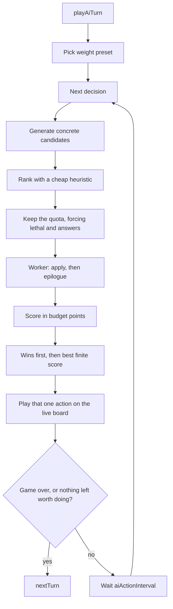

# Battle AI — Proposed Architecture

This replaces the decision procedure in [architecture.md](architecture.md). The match entry points stay: `playAiTurn()` is still called from [`init.ts`](../../init.ts) and [`turn.ts`](../../turn.ts), the AI is still player id `1`, and the UI still shows one action at a time.

The goal is a bot that plays decently. It should take an obvious win, avoid a death that the opponent's board can already deliver, and otherwise spend mana on actions that leave a better position. It does not need a long-term plan.

Cards and effects are data, and new ones appear at runtime. The AI does not learn what an ability does. It applies a concrete action through the battle engine, fast-forwards the consequences that are already determined, then scores the position from life, board, lands, mana, and cards. Hand-written code lists legal actions, decides which of them are worth simulating, and scores a position. The queue ranker is part of the policy: with a cap of 24 simulations, the bot can only play a line the ranker let through.

## Decision loop

Each live action is chosen from scratch. The AI does not commit to a script for the rest of the turn, because a random effect can change the board before the next play.



`actionsPlayedthisTurn` resets at the start of `playAiTurn`. The existing safety net still forces `nextTurn()` if a turn somehow loops. That counter is per turn, not per match.

The once-per-turn player ability is a candidate, same as a spell or an attack. It is not spent automatically before the search. Skipping it is allowed when every way to spend it scores worse.

## Candidates

A candidate is one concrete action, including its targets. Two different targets for the same spell are two candidates. Entities are stored by `instanceId` (and a position key for cells), never by object reference. The worker's clone is a different object graph.

| Kind | What is fixed on the candidate |
| --- | --- |
| Pass | Nothing further |
| Attack | Unit, and the legal target from `validAttackTargets` |
| Move | Unit and one destination cell on the AI half |
| Deploy | Unit card and one destination cell |
| Spell | Spell card and a full target assignment |
| Activate | Unit or land, ability index, and a full target assignment |
| Color | Which color threshold to raise |

Generation uses the rules that already exist: `isPayable`, `canAttack`, `canMove`, `getEmptyCells(false)`, `getEligibleTargets`, `validAttackTargets`. A candidate the rules reject is not generated.

Activated abilities on units are included when they are payable. Today they are missing from `getPossibleActions`.

Cells are collapsed before ranking. Each unit that can move contributes one candidate, whose destination is the best empty cell from the heuristic. Each deployable card contributes one candidate, the same way. Further cells of that unit fill leftover slots only. A quota of three moves is three units, not one unit on three irrelevant cells.

Target assignments are capped before ranking:

- At most **4** assignments per spell, ability, or flying/ranged attacker.
- Assignments are built greedily from the cheap heuristic (best target, then the next distinct one), not from the full cartesian product.
- The assignment that fills a quota slot is the best one. The other three enter only through leftover slots.
- Pass and the four color increments are not subject to this cap.

## Caps

Engine simulation is the expensive step. Generation and the cheap ranker are not. Defaults live next to the other AI settings in [`config.ts`](../../../_config/config.ts):

| Setting | Default | Meaning |
| --- | --- | --- |
| `maxSimulations` | 24 | How many candidates are cloned and resolved per decision |
| `maxAbsoluteSimulations` | 32 | Ceiling after forced lethal and survival inserts |
| `maxTargetAssignments` | 4 | Assignments considered per spell, ability, or multi-target attack |
| `randomSamples` | 1 | Resolutions averaged for a candidate. Stays 1 until a card is known to be random |

24 is the sum of the reserved quotas below, plus one leftover slot. Raising it is not the fix when one category fills the list; tightening that category's quota is.

A quota slot is one candidate. Unused reserved slots go back to the global rank list.

| Reserved | Count | What one slot is |
| --- | --- | --- |
| Pass | 1 | Always included |
| Color | 4 | One per color. All four are simulated. The ranker cannot tell which threshold unlocks a card; the score can. |
| Land ability | 2 | Best payable land activations |
| Spell | 4 | Best assignment of each of the four best spells |
| Deploy | 3 | Best cell of each of the three best cards |
| Move | 3 | Best cell of each of the three best units |
| Attack | 4 | Best legal target of each of the four best attackers |
| Unit activation | 2 | Best assignment of each of the two best abilities |

Equal heuristic ranks break by mana cost, highest first, then by stable `instanceId`. An unrecognized spell still receives a slot through the spell quota, and the expensive unknown is preferred over a cheap one.

Forced in even when the quota is full, counting toward the ceiling of 32:

- Every stats-obvious lethal attack.
- When the pass candidate's epilogue leaves the AI dead: at least one move or deploy into the row that kills them, and the spell and activation quotas fill with answers first (see the heuristic). A removal or a stun has to be inside the simulated set, or the survival pick has nothing to choose.
- A land that would be razed uses the same answer priority inside the normal cap. Only a player death raises the ceiling.

The AI plays the best candidate among those it actually simulated.

One worker handles the whole decision. It receives the baseline snapshot and the capped candidate list, clones the baseline once per candidate, and returns score breakdowns. It does not spawn a new worker per action.

## Cheap heuristic

The heuristic decides who receives a simulation slot. It does not choose the action that gets played among the lines that were simulated.

It may look at numbers already on the cards and the board: power, health, armor, card budget, whether an attack would kill its target, and whether a `damageUnit` or `destroyUnit` spell would kill a unit. It may use row danger from [`rows.ts`](../rows.ts) to order blocks. Effects it does not recognize share a neutral rank; the mana-cost tie-break then orders them. That peek at two effect names is only a sort. The position score never branches on effect names.

`rows.ts` reads the position it is given. It stops reading the global `simulatedNextTurn`. Its danger figure compares total power to total health, so it is only good enough to order the queue. The epilogue, not this number, decides whether a line actually dies.

### Stats-obvious lethal

Before the queue is trimmed, mark an attack as obvious lethal when combat stats alone say it wins this turn:

- The legal target is the opposing player and `power` is at least their life.
- Or the attack kills the only blocker in its row, and the ready power behind that trade is at least the land's health plus the opponent's life.

This check does not read spell text. Spell lethal is found by simulating the spell. Obvious lethal attacks are forced into the simulated set.

### Survival inserts

The pass candidate is always simulated, so the search knows what "do nothing" already loses. When that epilogue kills the AI, the forced set gains:

- one move or deploy into the killing row, when a legal cell exists
- spell and activation slots ordered as answers: a recognized kill spell first, then any other spell by mana cost, so an unrecognized stun or burn still gets resolved

Land-razing uses that same order inside the normal cap.

## Simulation

For each kept candidate the worker:

1. Replaces its battle state with a deep clone of the baseline. `populateBattleState` merges, so a fresh assign onto a reset state is required between candidates. Reset `uiState.battle` pending fields too.
2. Sets `uiState.isHeadless`.
3. Re-finds every unit, card, and land on that clone by `instanceId`, then applies the action through the engine with those references.
4. Resolves triggers (see below).
5. If either player is already dead, scores a terminal and stops. The epilogue does not run after the game is over.
6. Records latent attacks and unspent mana. Both expire if the turn ends, so they are measured here.
7. Runs the epilogue.
8. Scores the resulting position and adds the latent and mana credit back.

Each candidate is wrapped so one thrown action returns a loss for that candidate and the batch continues.

The winning action is played again on the live state. The simulated state is not copied back. Re-resolving on the live board keeps animations and real random rolls. `randomSamples` stays 1, so a card that rolls can score one outcome and live a different one. A later change can average several resolutions; each extra sample counts toward `maxSimulations`.

### Apply has to be synchronous and id-based

`apply.ts` is the only way a candidate is executed, in the worker and on the live board. It takes ids, resolves them on the current `bs`, and calls the engine.

`playSpell` pays the cost and then resolves the effect inside a `setTimeout` of about 750ms on the AI's turn. `isHeadless` does not bypass that. A search that scores when `playSpell` returns will see mana spent, the card still in hand, and the board unchanged, and the timer will mutate whichever candidate is running next. Headless apply resolves the effect and the discard in place, with no timer and no write to `uiState.battle.playedSpell`.

`attackUnit` checks the target with object identity (`t === target`). After `postMessage` the candidate's target is a different object, so the lookup by `instanceId` has to happen before the call. Effect code mutates the object it is given; that object has to be the one living on the worker's `bs`.

`nextTurn` calls `playAiTurn` whenever the turn flips to the AI. Headless mode only skips the sound. The epilogue will schedule a second AI loop on the worker unless `playAiTurn` is gated on `!uiState.isHeadless`.

## Trigger targets

Triggers that fire during apply need targets. Those targets are committed; they are not left to the queue heuristic, and they are not sampled at random.

Inside the candidate, the worker tries up to `maxTargetAssignments` legal targets. For each one it runs the same epilogue and score, and keeps the best result for the player who owns the trigger. An AI trigger maximizes the AI score. An opponent trigger maximizes the opponent's score, using the same formula with the weights swapped, so the search assumes the human aims it well. This is one extra ply on a short list, not a tree search, and it does not read effect names. That is what lets a trigger that draws, stuns, or buffs aim itself.

The same picker is used when the live AI resolves its own triggers, so the played line matches the searched one. Human triggers on the live board are still chosen by the human. `selectAiAbilityTargets` stops sampling at random.

## Epilogue

The score is taken after the consequences that are already on the board, not on the raw post-action snapshot. Otherwise a stun, a poison, a zerk, or a start-of-turn trigger is invisible, and a ritual's mana has nowhere to appear.

After the action and its triggers:

1. Remember latent attacks still legal this turn, and the mana credit below.
2. Fast-forward the end of the AI turn and the start of the opponent's turn: status ticks, mana growth, draw, poison and regeneration on the opponent's units, temporary effects that expire on them, zerk auto-attacks, start-of-turn triggers. Do not call `playAiTurn`.
3. Each opponent unit that `canAttack` swings **only when some legal target would die**: destroy a unit, raze a land, or reduce the AI to 0 life. Among those lethal targets it picks the greediest (player, then highest `valueUnit`, then land)—not merely `validAttackTargets()[0]`. That way a ranged unit that can kill a 2-HP body is not skipped because a healthier blocker appears first in the list. Non-lethal chips are skipped so inevitable counterswings do not punish trading. Row then column order among attackers. Lethal swings still use real combat: stun, armor, retaliate, trample.
4. Score that position. Add the latent credit and the mana credit from step 1.

Terminal checks happen twice. A kill during the AI action is a win before the epilogue, so their attackers do not get a turn. A death during the epilogue is a loss.

The epilogue does not cast the opponent's spells, deploy their hand, or move a unit into a new row. A haste card in their hand, and a unit that still has to move before it can reach, are outside this model. Poison on the AI's own units ticks at the start of the AI's following turn, after the opponent has played a full turn, so it is not applied here. Poison on their units is applied, because it ticks before they attack. Non-lethal combat damage the opponent could deal next turn is also outside this model; only lethal attacks are applied.

There is no separate `incomingDamage` term. Material a lethal attack sweep destroys is already gone. A second threat penalty would count it twice.

## Position score

`valuePosition` is a weighted sum in **budget points**, the same scale as `getCardBudget` (roughly 5–80 for a card). It does not branch on effect names. A buff, a stun, or a kill shows up because the epilogue changed life, stats, or who is on the board.

Terminals are sort keys, not terms in the sum. A win sorts above every finite score. A loss sorts below every finite score. Several wins are ordered by the finite score underneath, so two lethal lines still prefer the better board. Putting `+Infinity` and `-Infinity` in the same addition produces `NaN` when a line wins while attackers are still on the board.

```
score =
  opponentLifeWeight * opponentLifeLost
  - aiLifeWeight     * aiLifeLost
  + boardWeight      * (ownUnitWeight * aiUnitValue - enemyUnitWeight * opponentUnitValue)
  + landWeight       * (aiLandValue - opponentLandValue)
  + handWeight       * ownHandValue
  + colorWeight      * colorProgress
  + manaCredit
  + latentCredit
```

Life is measured as points lost from the start of the decision, so face damage is positive for the AI when the opponent loses it. The two life weights are independent. One coefficient on `aiLife - opponentLife` cannot express "care more about their life and less about mine."

The board term is asymmetric on purpose. Retaliate has no separate line item: it only shows up as lost own durability (or a dead attacker). With `ownUnitWeight < 1` and `enemyUnitWeight > 1`, chipping a retaliate blocker is favored over a pure equal trade on the board, without searching future turns for the cleanup attack.

### Exchange rates

These are the starting weights. They are the play policy. Tune them from whole games. Do not add an effect-name case to make one card look right.

| Outcome | Budget points |
| --- | --- |
| 1 point of opponent life | **4**, matching the power feature cost |
| 1 point of AI life, Normal | **4** |
| 1 point of AI life, Aggro | **2**, and opponent life **6** |
| 1 point of AI life, Defend | **6**, and opponent life **3** |
| Standing land | **22**, about a 4-mana card |
| Ruined land | **4**. A ruin can still have abilities, and it can no longer be attacked |
| Card in the AI hand | **0.35** of its full budget, including OnDeploy |
| Card in the opponent's hand | **4** flat. The scorer does not read their hand or the deck order |
| 1 unspent mana that still pays toward a card in hand | **3**. Pass gets **0**: ending the turn discards the pool |
| Unspent mana that pays nothing currently in hand | **0** |
| A hand card that this action newly makes payable | **0.25** of that card's budget, as color progress |
| A hand card still short of its colors | **0.10** of its budget times the fraction of thresholds this action closed |

`boardWeight`, `landWeight`, `handWeight`, and `colorWeight` start at **1**. Normal also uses `ownUnitWeight` **0.85** and `enemyUnitWeight` **1.2** (Aggro **0.7** / **1.35**, Defend **1** / **1**). The numbers above are already in budget points. Aggro also lowers `boardWeight` to **0.7**. Defend leaves it at **1**.

Developing a body is the large swing: a card leaves the hand at 0.35 of budget and arrives on the board near full `valueUnit`. With opponent life at 4 per point, a 4-damage face hit is 16, and a medium body is often more than that. That is intentional for Normal. Aggro's life weight of 6, and its lower board weight, is what makes the race win the comparison. If games show Normal never attacking until lethal, raise `enemyUnitWeight` or opponent life before adding multi-step search.

Mana is credited from the post-action state, before the epilogue ends the turn and wipes it. A ritual that only adds mana the hand can spend therefore beats pass. Mana that enables nothing in hand does not. The **pass** candidate gets no mana credit: passing throws the pool away.

Color progress is only the change in payability. The hand term already counts every card at 0.35 whether or not it can be cast. A color bump that unlocks nothing adds about zero, so the bot will pass rather than spend the ability on a random color.

### Unit value

`valueUnit` is the body on the board. It is not a linear fraction of the printed budget.

OnDeploy is a one-shot. Once the unit is deployed, the engine has already applied it, and the epilogue scores whatever that effect did. Counting the ability again treats the enter text as permanent stats. Subtract `getAbilityCost` for every ability whose trigger is `OnDeploy`. Other triggers, including `OnTurnStart`, stay in the budget, because they will keep firing. The current halving of any unit that merely has an OnDeploy ability goes away.

Missing health reduces value, and only the health portion. A unit at 1 health attacks for its full power, so the rest of the budget is unchanged. Health is priced at the existing feature cost, 2 per point of `maxHealth`. Current power is repriced at 4 per point, so a buff that changed power shows up on the body even when the unit cannot attack yet.

```
onDeployCost   = sum of getAbilityCost for OnDeploy abilities
printed        = getCardBudget(unit) - onDeployCost
healthBudget   = maxHealth * 2
printedPower   = printedPowerStat * 4
threat         = printed - healthBudget - printedPower + currentPower * 4
durability     = healthBudget * sqrt(currentHealth / maxHealth)
valueUnit      = threat + durability
```

`sqrt` is the curve. A 4-health body keeps about 70% of its health budget at half health, and half of it at 1 health. A linear `current / max` would cut that 1-health body to a quarter, and scaling the whole budget would also throw away its attack. Threat stays whole at every health total.

A card in hand uses the full `getCardBudget`, OnDeploy included, times 0.35. The enter effect has not happened yet. After a simulated deploy, the body is `valueUnit` (OnDeploy removed) and the effect itself is whatever the engine changed.

`valueBoard().rel` uses this `valueUnit`. An empty board is ratio 0.5, so the preset picker does not see `NaN`. Lane placement is not part of `valueUnit`, so it does not move the persona threshold.

### Lane

`laneValue` is added on top of `valueUnit` inside the board term. It is the only place the score looks at which row a body occupies. One point of power that can reach, or one point of enemy power a front body is actually walling, is `lanePoint` (1) budget point, then the usual own/enemy unit weights.

- Open row, or a blocker this unit can chip: offense is the unit's power, scaled down by how much health is in the way. A friend in front does not stop the swing.
- Non-ranged into retaliate that would kill the attacker: offense is 0. Ranged still chips (it does not take that retaliate). Flying treats the row as open.
- A front body walls only when it survives the row's power, or its retaliate kills the attacker. The credit is the power it catches, not its whole health. An empty row gives a wall nothing. A body behind a friend does not wall.

The same numbers rank which cell is the primary move or deploy, so the reserved slot is the useful row. The term is small next to a deploy or a trade. It exists so a free step off a brick, or a wall stepping into a real threat, beats passing.

### Latent attacks

This is how a one-step search sees "remove the blocker, then hit" without simulating the attack that follows. It is computed after the action, before the epilogue gives the turn away.

Walk ready AI units that `canAttack`, highest current power first. Each one looks at its current legal target, then at the next target as if bodies already killed by an earlier latent swing were gone. One body is killed once. The credit is `latentFactor` times the same delta `valuePosition` would get if the swing had already landed:

- Player: `power * opponentLifeWeight * latentFactor`
- Unit: the drop in `valueUnit`, times `latentFactor`. A kill is the whole value. A chip is only the durability change, because threat does not shrink with health. Retaliate is applied only when the defender survives (same as combat). If that retaliate would kill the attacker, subtract `latentFactor * valueUnit(attacker)`.
- Land: damage valued like the land score term, times `latentFactor`. A swing that razes the land takes the standing/ruined gap. Land retaliate only if the land is not razed.

Each swing's credit is clamped at **0**. A suicide the bot would skip does not punish a deploy or color play. `latentFactor` starts at **0.85**. Because the credit uses the same budget points as an immediate swing, attacking now outranks leaving the same swing for later. The estimate uses combat stats and `validAttackTargets` only. It does not cast spells.

The **pass** candidate does not receive latent credit: passing ends the turn, so those attacks will not happen. Other candidates still get it, so a deploy or color play is not punished for deferring a swing the loop can take next.

Latent value misses "move, then attack" when the move is what opens the attack, and it misses a second spell. Those lines are the job of greedy continuation, which stays off.

## Personas

Persona is a weight preset, not a separate policy. `getAiStrategy` selects it from board share, using `valueUnit`: below 0.3 defend, above 0.7 attack, otherwise normal. Aggro as a persona is the Aggro preset for the whole match. `Turtle` and `Reach` stay unused until a preset exists for them.

| Preset | Bias |
| --- | --- |
| Normal | Life at 4 per point on both sides, board weight 1 |
| Aggro | Opponent life at 6, own life at 2, board weight 0.7 |
| Defend | Own life at 6, opponent life at 3, board weight 1 |

## Greedy continuation (later, off by default)

One-step search plus latent attacks still misses a kill that needs two non-attack actions, or a move that only pays off because of the attack after it. Continuation would ask: "If I take this first action, and then keep playing greedily until I would pass, how good is the end of my turn?"

It stays behind `continuationEnabled = false`. The branch it would explore is the heuristic's top few, so it finds a second step the ranker already liked. It does not find the spell the ranker left outside the quota. Turn it on only when real games show a two-step line (move then attack, or two spells) that latent attacks and the epilogue both miss. Defaults if that happens: `continuationSteps = 6`, `continuationBranch = 4`, latent credit off on the final score so the same future damage is not counted twice. The live loop still plays only the first action, then replans.

## What this retires

Once search is the live policy, these stop driving decisions:

- The priority list in [`personas/normal.ts`](../personas/normal.ts) and the random policy in [`personas/aggro.ts`](../personas/aggro.ts)
- Card `aiHints`, goal matching on those hints, and `AiTurnGoal` as an input to play
- Effect-name scoring in [`spells.ts`](../spells.ts) as a way to choose a spell
- Spending the player ability before any search, including `incrementRandomColor` as a default
- The global `simulatedNextTurn` snapshot, which today is recomputed before every action and does not try the AI's own moves

Card budget, combat legality, and headless clones stay. Row danger stays as a queue hint. The per-candidate epilogue replaces the pass snapshot as the way the bot looks one turn ahead.

`config.aiPolicy` stays `'heuristic' | 'search'` after search is the default, so a bad match can be flipped back and compared. Delete the old persona only after a few real games under `'search'`.

## File map

| File | Role |
| --- | --- |
| `ai.ts` | Turn entry and the live loop. Asks the search for one action, plays it, repeats. |
| `search.ts` | Generate, rank, cap, dispatch, pick the winner |
| `candidates.ts` | Concrete action objects from the battle rules, stored by id |
| `heuristic.ts` | Queue order, cell choice, obvious lethal, survival inserts |
| `apply.ts` | Resolve ids on the current `bs` and apply one candidate synchronously |
| `epilogue.ts` | Fast-forward turn end, opponent turn start, and their attacks |
| `evaluate.ts` | `valueUnit`, `valuePosition`, weight presets, exchange rates |
| `lane.ts` | Row placement added to the board term: live power, and walls that actually catch a threat |
| `latent.ts` | Discounted value of attacks still available this turn, in budget points |
| `ai.worker.ts` | Batch-evaluate candidates from one snapshot, return score breakdowns |
| `valuations/config.ts` | The exchange-rate numbers and `latentFactor` |
| `rows.ts` | Queue-only row danger. Takes a state. Does not feed the score |
| `config.ts` | `maxSimulations` and the other caps |

[`model.ts`](../model.ts) holds the candidate type and the weight-preset enum. `PersonaType` becomes that preset. `PossibleActions` is replaced by the candidate list.
