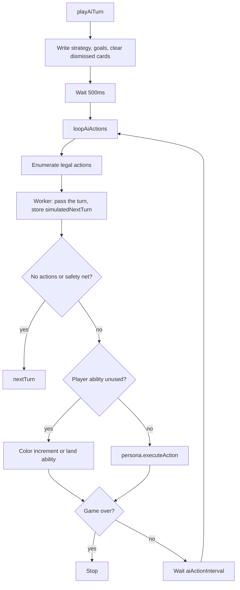

# Battle AI — Architecture

This document describes the AI as it works today. The replacement design is [proposed-architecture.md](proposed-architecture.md). The migration steps are [implementation-plan.md](implementation-plan.md).

The battle AI plays the opponent (player id `1`) during a match. The human is always player id `0`. It does not search a game tree. Each turn it picks a stance and a short list of goals, then repeatedly chooses one legal action until nothing useful remains, and passes.

Game rules live in [`src/doc/game_rules/tcg-design.md`](../../../../doc/game_rules/tcg-design.md). This document describes the code, including behavior that is defined but not yet used by action selection.

## How a turn starts

`playAiTurn()` in [`ai.ts`](../ai.ts) is called from two places:

- [`init.ts`](../../init.ts), when the AI wins the opening coin flip
- [`turn.ts`](../../turn.ts) `nextTurn()`, when the turn flips to the AI

The live persona is the constant `AI_PERSONA` in `ai.ts`. It is `PersonaType.Normal`. `PersonaType.Aggro` exists and is mapped, but nothing selects it at runtime.

At the start of the turn the loop writes three fields on `bs.aiState` (`AiState` in [`model-battle.ts`](../../../_model/model-battle.ts)):

| Field | Set by | Used by action choice |
| --- | --- | --- |
| `strategy` | `getAiStrategy` | Stored only. Personas do not read it. |
| `goals` | `getAiGoals` | Yes. Normal persona and move valuation. |
| `dismissedCards` | Cleared to `{}` | Yes. Cards that cannot be targeted are skipped for the rest of the turn. |

`strategy` and `goals` are computed once per turn. They are not refreshed after each action.

## Turn loop

`playAiTurn` waits 500ms, then `loopAiActions` runs until the AI passes or the game ends. Between actions it waits `config.aiActionInterval` (1s) so the UI can show each play.



Each iteration does exactly one of: spend the once-per-turn player ability, or let the persona play one card / move / attack. The player ability is outside the persona. If `abilityUsed` is false, the loop spends it before any card or attack, every turn.

`actionsPlayedthisTurn` is a module-level counter. It is not reset in `playAiTurn`, so `MAX_ACTIONS_SAFETY_NET` (100) counts actions across the match, not within one turn. Hitting it forces `nextTurn()`.

## Legal actions

`getPossibleActions(false)` always inspects player 1. The `isLeaderPlayer` argument is unused by the loop. An action is legal when:

- **Deploy** — unit in hand, payable, board not full, not dismissed
- **Spell** — spell in hand, payable, not dismissed
- **Move** — deployed unit that `canMove`, and the board is not full
- **Attack** — deployed unit that `canAttack` and has `power > 0`
- **Player ability** — `abilityUsed` is false (color threshold or one land activation)

Activated abilities on units are not in this set. The AI never chooses to activate them. When a triggered ability on an AI unit needs targets, [`targetting.ts`](../../../ui/_helpers/targetting.ts) calls `selectAiAbilityTargets`, which picks eligible targets at random.

## Personas

A persona is an `AiPersona`: one method, `executeAction(possibleActions)`. The registry is [`personas/mappings.ts`](../personas/mappings.ts).

### Normal

[`personas/normal.ts`](../personas/normal.ts) is a fixed priority list. The first match plays and returns. Cards in hand are considered before units already on the board.

**Hand**

1. If the goal is `LethalAttackRow`, deploy the highest-power haste unit into that row.
2. For each goal, play the best spell whose `aiHints` include that goal, then the highest-cost unit whose `aiHints` include it. `BreachRow` and `LethalAttackRow` deploy into the goal's row; other goals use the best cell on the board.
3. Otherwise play the highest mana-cost card that is currently playable. Spells hinted `Reset` are excluded here so a board wipe is only cast when it was chosen as a goal. Ties are not broken beyond sort order.

A spell with no legal targets is written into `dismissedCards` and the function returns false, so the same iteration does not fall through to a unit. The next loop skips that card.

**Board**

1. If the goal is `BreachRow` or `LethalAttackRow`, move the strongest `moveAndAttack` unit that is not already in that row into it.
2. Otherwise pick one attacker (see attack order below) and compare attacking with moving. Attack unless the best move scores higher than the attack after counter-attack cost.
3. If nobody can attack, move a random legal unit to its best cell.

Attack order in a row, when several units can attack the same blockers:

- A `lance` attacker, if there is more than one blocker
- A `cleave` attacker, if the closest blocker has a neighbor in its column
- The smallest attacker that would kill the front blocker, otherwise the biggest

`attackOrMove` has a note that `AiTurnStrategy` should weight this comparison. It does not today.

### Aggro

[`personas/aggro.ts`](../personas/aggro.ts) ignores goals, spells, and valuations. It auto-attacks a random ready unit, otherwise deploys a random unit on a random empty cell, otherwise moves a random unit to a random empty cell.

## Strategy and goals

Both are functions of `PersonaType` plus the current board. Aggro always gets `AiTurnStrategy.Attack` and an empty goal list.

### Strategy

[`strategy.ts`](../strategy.ts) reads `valueBoard().rel`, the AI's share of total unit value:

- below `0.3` → `Defend`
- above `0.7` → `Attack`
- otherwise → `Normal`

`AiTurnStrategy` also defines `Turtle` and `Reach`. Nothing returns them. Because personas never read `bs.aiState.strategy`, changing this function does not change play until a persona starts using it.

### Goals

[`goals.ts`](../goals.ts) returns the first match:

1. **Lethal row.** [`lookForLethalRow`](../rows.ts) finds a row where AI power, plus the best haste unit in hand and the best `moveAndAttack` unit elsewhere, can kill the opponent through that row's land. If the row has no blockers, the only goal is `LethalAttackRow`. If it has blockers, the goals are `BreachRow` plus one `RemoveUnit` per blocker.
2. **Board wipe.** If `valueBoard().abs` is at or below `-baordWipeThreshold` (about two 4-mana cards), the goal is `Reset`.
3. Otherwise no goals. The Normal persona then plays its highest-cost card and attacks by local value.

`AiTurnGoal.BlockRow` and `DestroyLand` are defined on the enum and are not assigned.

Goals carry `args`: `{ row }` for row goals, `{ unit }` for `RemoveUnit`.

### Card hints

`BaseCardTemplate.aiHints` is an optional list of `AiTurnGoal` values. It is how a card tells the AI what job it can do. The Normal persona matches hints with `includes(goal)`. In [`base-deck.ts`](../../../../data/base-deck.ts) the only hint in use is `RemoveUnit`. A removal spell with no hint is treated as a generic high-cost play, not as a tool for `RemoveUnit`.

## Valuations

Numbers are heuristics, not win probabilities. Weights live in [`valuations/config.ts`](../valuations/config.ts). Unit values come from the sim card budget (`getCardBudget`), which is typically on the order of 5–80. The large constants (`landDestructionValue` is `1000000`, a lethal face attack is `Infinity`) exist so blocking a dying land or killing the opponent outranks ordinary trades.

Several readers use `simulatedNextTurn ?? bs`. When the worker has finished, row danger, board value, and counter-attack look at the board after a pass, not at the live board. See [Pass simulation](#pass-simulation).

### Units and the board — `valuations/unit.ts`

`valueUnit` is card budget, halved when the unit is missing at least half its health, and halved again when it still has an `OnDeploy` ability (the enter effect has not been spent).

`valueBoard` sums AI unit values minus human unit values:

- `abs` — the difference. Goals use this for the wipe check.
- `rel` — AI value divided by the total. Strategy uses this. If both sides have no units the ratio is `NaN`, and strategy falls through to `Normal` because both comparisons fail.

`wouldBeDestroyed` is attacker damage (power + poison + rage) against health + armor. `wouldBeDestroyedBySpell` treats `destroyUnit` as a kill, and `damageUnit` as a kill when `args.damage` meets health + resist.

### Attacks — `valuations/attack.ts`

`getHighestValueTarget` scores every target `validAttackTargets` returns and keeps the max:

- **Player** — `Infinity` if this swing is lethal, otherwise `power * playerLifeValue`
- **Land** — `landDestructionValue` if this swing razes it, otherwise `power * landLifeValue`
- **Unit** — `valueUnit`, doubled if the swing would destroy it

Retaliate and armor are not part of this score. Counter-attack cost is applied later, in `attackOrMove`.

### Moves — `valuations/move.ts`

`getHighestMoveValue` scores every empty cell on the AI half and picks one of the cells tied for the best score at random. `getHighestMoveValueInRow` restricts that search to one row, and falls back to the full board if the row is full or every cell there scores `-Infinity`.

Per-row inputs come from [`rows.ts`](../rows.ts):

- enemy damage in the row (power + rage, and cleave copied into adjacent rows)
- allied health in the row
- `getDangerLevelPerRow`: `0` if allied health covers the damage; otherwise `landDestructionValue` or `landLifeValue` if a land would be hit, and `Infinity` or `playerLifeValue` if the land is already ruined and the player would be hit

Cell score, first match wins:

- `LethalAttackRow` and this unit is the one that should deliver it: `Infinity` on that row, `-Infinity` elsewhere. A stronger haste or `moveAndAttack` unit is allowed to leave.
- Standing in a row that is already `Infinity` danger: `-Infinity` (do not move off the block)
- Moving into an `Infinity` row: `Infinity` (must block)
- Moving onto a land that would be destroyed, if this unit survives: `landDestructionValue`
- Otherwise a small integer: minus `valueUnit` if the unit would die there, plus one for a favorable power matchup, plus one for a high-health unit blocking, plus half the value of an allied unit behind the cell that the enemy could kill

### Counter-attack — `valuations/counter-attack.ts`

`getCounterAttackValue` is the value the attacker loses by staying in the row. If the defenders (excluding a target this swing would kill) destroy it, the cost is `valueUnit(attacker)`. If the attacker has retaliate and a target, the function returns a negative number, which increases the attack's net value. Otherwise the cost is `0`.

`attackOrMove` then uses:

```
attackValue = bestAttackValue - counterAttackValue
```

and attacks when that is at least as good as the negative of the counter-attack it would face after the best move. A move scored `Infinity` (must block) always wins this comparison.

### Spells — `spells.ts` and `target.ts`

`spellWouldKillUnit` returns `1` for `destroyUnit`, `damage / health` for `damageUnit` (field `args.amount`), and `0` otherwise. `selectBestSpellForRemoveUnit` prefers the cheapest spell that returns `>= 1`, otherwise the spell with the highest ratio.

`selectAiSpellTargets` asks the battle targeting rules for eligible targets, then:

- Drops friendly units for spells hinted `RemoveUnit`, and enemy units for every other spell. A buff with no hint is aimed at friendly units. A non-removal spell with no `ownerPlayerId` on the target (a cell, for example) is kept.
- Returns `null` if a target group cannot be filled. The persona dismisses the card.
- For removal, prefers units named by current `RemoveUnit` goals, then the highest `valueUnit` among targets the spell would destroy, then the highest-value unit anyway.
- If the spell has a single `effect.args.range`, scores each candidate by the sum of `valueUnit` over units in that range.
- Anything else is random.

`selectAiAbilityTargets` does not use goals or value. It samples `count` eligible targets at random for each target definition.

## Mana: colors and lands

Spending the player ability is mandatory in the loop, before the persona runs. [`ai.ts`](../ai.ts) `usePlayerAbility`:

1. [`getColorToIncrement`](../colors.ts). If some card in hand becomes payable after exactly one color threshold increase, return that color. Otherwise return the color the AI has least of, if that threshold is still below `2` or below the highest requirement of that color in hand. Otherwise return `null`.
2. If a color was chosen, `usePlayerColorAbility` increments it and sets `abilityUsed`.
3. If not, [`usePlayerLandAbility`](../lands.ts) activates the first payable activated ability on a land, but only when mana left after that cost still covers the most expensive card in hand. It walks lands in order and can activate only one, because `abilityUsed` flips.
4. If no land qualifies, `incrementRandomColor` spends the ability on a random color anyway. The ability is never saved for later in the turn.

## Pass simulation

[`ai.worker.ts`](../ai.worker.ts) is a separate module instance of battle state. The only message it handles is `EVALUATE_PASS_TURN`:

1. `populateBattleState` from a JSON clone of `bs`
2. `uiState.isHeadless = true` so `nextTurn` does not touch the UI, and so it does not call `playAiTurn` again after the flip (the turn becomes the human's)
3. Post back the resulting `bs`

`evaluateMove` stores that snapshot on `simulatedNextTurn`. The snapshot is the start of the human turn if the AI passed immediately: end-of-turn statuses, mana growth, draw, and start-of-turn triggers. It is not a prediction of how the human will play, and it is not a search over the AI's own actions. The loop still recomputes it before every action, on the pre-action state, so it stays "what if I pass right now" rather than "what if I pass after the action I am about to take."

## File map

| File | Role |
| --- | --- |
| `ai.ts` | Turn entry, action loop, legal-action list, worker client |
| `ai.worker.ts` | Headless pass-the-turn snapshot |
| `model.ts` | `AiPersona`, `PersonaType`, `PossibleActions` |
| `strategy.ts` | Stance from board share. Written, not read. |
| `goals.ts` | Lethal row, then board wipe, else nothing |
| `personas/normal.ts` | Priority policy used in matches |
| `personas/aggro.ts` | Random policy, not selected |
| `personas/mappings.ts` | Persona enum to implementation |
| `rows.ts` | Per-row power, count, health, danger, lethal row |
| `valuations/config.ts` | Scalar weights and the wipe threshold |
| `valuations/unit.ts` | Unit value, board value, destroy checks |
| `valuations/attack.ts` | Best attack target |
| `valuations/move.ts` | Best cell |
| `valuations/counter-attack.ts` | Cost of staying in a row |
| `spells.ts` | Fraction of a unit's health a spell removes |
| `target.ts` | Spell targets by goal and value; ability targets at random |
| `colors.ts` | Which color threshold to raise |
| `lands.ts` | Which land ability to activate |
| `type-checks.ts` | Narrow an attack target to unit, land, or player |

Shared enums `AiTurnStrategy` and `AiTurnGoal` live in [`enums-battle.ts`](../../../_model/enums-battle.ts). Persisted turn memory is `BattleState.aiState`.
