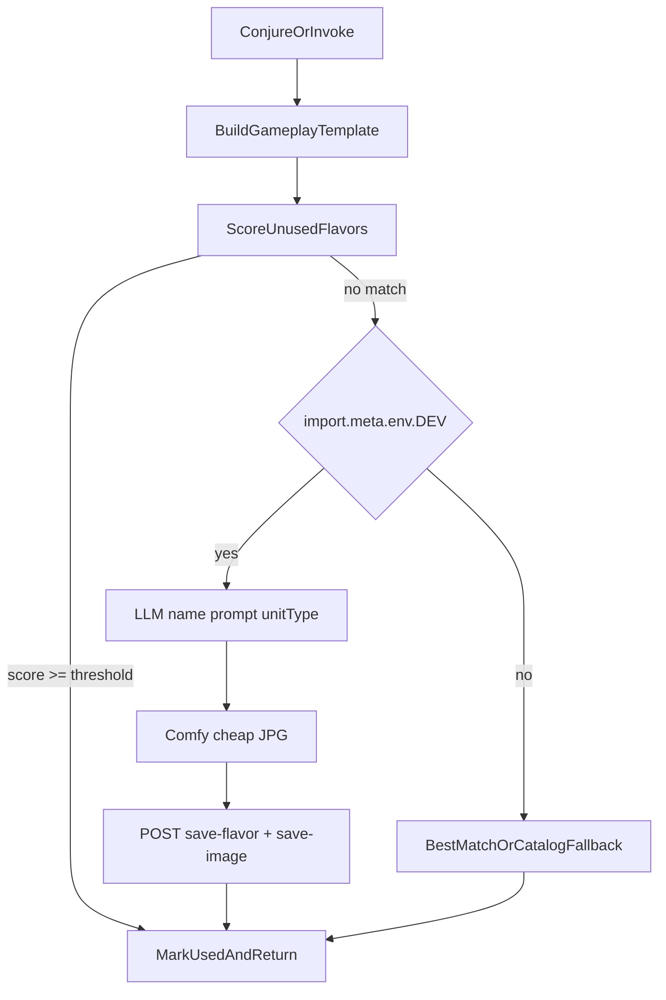

# Flavor Generation Pipeline — Systems

## Purpose

Card gameplay is rolled at runtime (conjuration / invocation). Names and art come from **flavor templates**: either an unused catalog match, or (in DEV playtest) a newly generated name + image prompt + cheap local image persisted into the repo.

Production builds only match the bundled catalog. There is no on-the-fly AI generation outside DEV.

## Core types

### GameplayTemplate

Derived from the conjured card after budget/cost resolution:

- `cardType` — unit or spell
- `colors` — mana colors
- `powerLevel` — `weak` | `medium` | `powerful` from mana cost (0–3 / 4–6 / 7+)
- optional `keywords` (units)
- optional `actions` — action template names
- optional `unitTypes` (units)

### FlavorTemplate

Stored in [`src/data/sim/card_flavor_templates.json`](../../../../data/sim/card_flavor_templates.json):

- gameplay query fields: `cardType`, `colors`, `unitSize` (same bands as powerLevel), `keywords`, `actions?`, `unitTypes?`
- presentation: `name`, `imageName`, `imagePrompt`
- `cheapImage` — true when generated via local Comfy

## Runtime flow

1. Artificery builds gameplay stats (`buildUnitCard` / `buildSpellCard`), then a `GameplayTemplate`.
2. `resolveFlavorTemplate` loads the catalog, excludes IndexedDB-used rows (and optional in-batch used sets), scores candidates.
3. If best score ≥ `MATCH_SCORE_THRESHOLD`, that flavor is marked used and returned.
4. Else in DEV: LLM text → Comfy image → Vite persist → mark used → return.
5. Else (non-DEV or generation failure): catalog fallbacks (best unused, then any unused same type).

## Matching

[`match.ts`](match.ts) scores unused flavors against a gameplay template:

| Property | Weight |
| --- | --- |
| Each matching color | 9 |
| Exact powerLevel / unitSize | 2 |
| Adjacent power band | 1 |
| Each matching keyword | 3 |
| Each matching unit type | 3 |
| Each matching action | 3 |

Return the highest-scoring template if score ≥ threshold; otherwise treat as a miss.

## Used-flavor tracking

Dexie table `usedFlavorTemplates` (key: `imageName`).

- Cleared in `initSim` when a new game starts.
- Marked when a flavor is successfully applied to a created card.
- Conjuration option batches also pass an in-memory `UsedFlavors` set so options in the same batch do not reuse names/images.

## Generation (DEV only)

| Step | Module | Notes |
| --- | --- | --- |
| Text | [`generate-text.ts`](generate-text.ts) | Mistral via `completeChat`; JSON `{ name, imagePrompt, unitType? }` |
| Image | [`generate-image.ts`](generate-image.ts) | Comfy Desktop Flux.2 Klein (`image_flux2_klein_text_to_image` API graph, 512×512); `cheapImage: true` |
| Persist | [`persist.ts`](persist.ts) | `POST /api/save-flavor`, `POST /api/save-card-image` |

Comfy notes:

- Workflow API JSON: [`workflows/image_flux2_klein_text_to_image_api.json`](workflows/image_flux2_klein_text_to_image_api.json) (flattened base-4B path from the default template).
- Models: `flux-2-klein-base-4b.safetensors`, `flux-klein-u.safetensors`, `flux2-vae.safetensors`.
- DEV browser calls use Vite proxy `/comfy-api` → `http://127.0.0.1:8188` (override with `VITE_COMFY_URL`).
- Comfy writes to its configured output dir (Desktop shared: `ComfyUI-Shared/output`); we fetch via `/view`, then copy into `public/assets/images/cards`.

Orchestrator: [`resolve.ts`](resolve.ts).

## Persistence boundaries

| Environment | Catalog | New flavors / images |
| --- | --- | --- |
| DEV (Vite) | Bundled JSON + live append via middleware | Writes `card_flavor_templates.json` and `public/assets/images/cards/{imageName}.jpg` |
| Production | Bundled JSON only | No generation; match + fallback only |

Vite watch ignores `card_flavor_templates.json` to avoid full reloads on append (same pattern as `events.json`).

## Image upgrade (deferred)

[`upgrade.ts`](upgrade.ts) exposes `ImageUpgradeProvider` with a no-op mock. Intended later: poll a remote API (~6 images/day), replace cheap JPGs, set `cheapImage: false`.

## Integration points

| Location | Change |
| --- | --- |
| [`artificery.ts`](../../actions/artificery.ts) | Async `getUnitTemplate` / `getSpellTemplate` / `getNewCardTemplate` / `invokeCard` / `getConjurationOtions`; call `resolveFlavorTemplate` |
| [`init.ts`](../../init.ts) | Clear used-flavor table |
| [`_actions.ts`](../../actions/_actions.ts) | `performAction` awaits async Invoke |
| UI (`Conjure.svelte`, `SceneActions.svelte`) | Await async conjuration option generation |
| [`database.ts`](../../../_state/database.ts) | Dexie v4 `usedFlavorTemplates` |

## Module map

| File | Role |
| --- | --- |
| `types.ts` | Shared types + `costToPowerLevel` / `toGameplayTemplate` |
| `match.ts` | Threshold scoring |
| `used-flavors.ts` | IndexedDB helpers |
| `generate-text.ts` | LLM step |
| `generate-image.ts` | Comfy cheap image |
| `persist.ts` | Dev save APIs |
| `upgrade.ts` | Mock upgrade provider |
| `resolve.ts` | Match → generate → persist → mark used |
